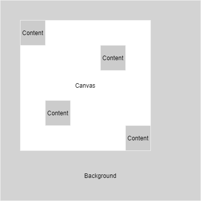

# Infinite canvas

## About

A Jetpack Compose implementation of component that contains draggable nodes wrapped in a dynamically drawn rectangle

## Features

- Drawing a rectangular canvas whose dimensions depend on the dimensions and position of the content
- Moving the canvas and nested content
- Moving individual content nodes